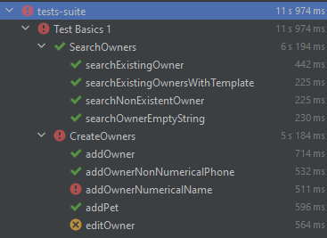

# Préambule

Ce projet permet de tester l'application [Petclinic](https://github.com/spring-projects/spring-petclinic).
Il implémente l'API Sélénium WebDriver et le framework de tests TestNG permettant ainsi tester l'ensemble des fonctionnalités de l'application. 

## Architecture
Chaque fonctionnalité sera représenté par une classe java, on retrouvera également une classe GeneralTests permettant de définir un ensemble de méthodes communes à pour toute les fonctionnalités.
La classe TestsUtils quand à elle sera en charge de la gestion du WebDriver. 

Au sein de ce projet nous éxécuterons les tests pour la préprouction sur la branch develop et les tests sur la branch master. 
Tout développement sur le projet de tests sera effectué sur une branch feature qui pourra ensuite être merge vers develop qui elle même sera merge vers master. 

# GitLab CI 
## Schedule 
Ce projet aura également une fonction de support via les fonctionnalités de programmation de pipeline. 
Nous avons intégré dans notre configuration yml des jobs qui ne s'exécute que lorsque la source du pipeline est schedule. L'un est exécuté sur la branch develop pour la préproduction et l'autre est effectué sur la branch master pour la production. 

L'idée serait ensuite d'intégrer un stage report qui se chargerait d'envoyer un message au support, via un webhook mattermost par exemple, en cas d'echec des tests. 
Actuellement job test fait un exit 0 dés qu'il a exécuté les tests. On pourrait imaginer inclure un mécanisme pour parse les réultat de tests et exit 1 en cas de faillures ou d'erreurs. 
Dans ce cas notre job report serait uniquement on faillure et il enverait un message indiquant que les résultats sont à annalyser. 

## Résultats de tests
Atuelement nos tests sont en echec du à un problème d'installation du chromedriver (détaillé dans le rapport). 
Nos tests sont néanmoins fonctionnel pour une exécution en local et voici les résultats : 

Cette exécution à mis en lumière un comportement anormal de l'application ainsi qu'un bug : 
1. addOwnerNumericalName met en évidence le fait qu'il est possible de créer un propriétaire dont le prénom contient des caractères alphanumérique
2. editOwner montre que l'édition d'un propriétaire cause la suppression de ses animaux de companies
